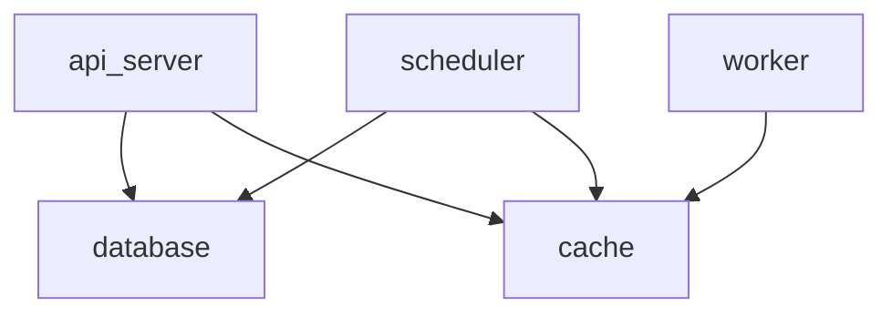

# 🌌📺 OmniverseTV API

The backend service for a fictional **Interdimensional TV subscription platform**, showcasing a **robust, scalable, and high-performance API**.

---

## 🚀 Project Description
OmniverseTV is the backend service for a fictional Interdimensional TV subscription platform.  
This portfolio project showcases a **robust, scalable, and high-performance API** built with a **modern tech stack** and a **professional, layered architecture**.

The core feature is a **complete subscription management system** for accessing TV channel packages from across the multiverse.  
A key technical challenge is the **asynchronous, on-demand translation engine**, which automatically translates channel and package names into the user's preferred language using a background worker process, with results cached in Redis for optimal performance.

The entire application is **containerized using Docker** for consistency and ease of deployment.

---

## ✨ Key Features
- 🔑 **Secure User Authentication**: Full JWT-based authentication flow (register, login, logout, refresh) with tokens stored in secure HttpOnly cookies.  
- 📦 **Complete Subscription Lifecycle**: Logic for creating, viewing, and canceling subscriptions, with future expiration handled by a scheduler.  
- 🌍 **Dynamic Content Catalog**: Public API endpoints to browse dimensions, channel packages, and individual channels.  
- ⚡ **Asynchronous Translation Engine**: On-demand translations without blocking the UX, powered by BullMQ + Redis.  
- 🚀 **High-Performance Architecture**: Multi-layered caching strategy (Redis) and optimized queries (Sequelize).  
- 🧩 **Robust & Scalable Design**: Layered architecture (Routes, Controllers, Services, Models), validation with Zod, and centralized error handling.  
- 🐳 **Containerized Environment**: Fully configured with Docker and Docker Compose.  

---

## 🏗️ System Architecture
The application runs in a **multi-container Docker environment**:

- **api_server**: Node.js/Express API handling requests  
- **worker**: Processes background jobs from BullMQ  
- **scheduler**: Handles delayed jobs for subscription events  
- **database**: MySQL container for persistent storage  
- **cache**: Redis for caching + BullMQ message broker  



---

## 🛠 Tech Stack
- 🔵 **TypeScript** – Type-safe backend code  
- 🟢 **Node.js & Express.js** – Core server & routing  
- 🐬 **MySQL & Sequelize** – Relational database & ORM  
- 🟥 **Redis** – High-performance caching & broker  
- 📨 **BullMQ** – Asynchronous job queue  
- 🛡 **Zod** – Request validation  
- 📖 **Swagger/OpenAPI** – API documentation  
- 🧪 **Jest & Supertest** – Integration tests  
- 🐳 **Docker & Docker Compose** – Containerization  

Badges:  
  
  
  
  
  

---

## ⚡ Getting Started

### ✅ Prerequisites
- Docker & Docker Compose installed  
- Node.js (v18+) & npm installed  

### 🔽 Installation
```bash
git clone https://github.com/saulm96/OmniverseTV-api.git
cd OmniverseTV-api
cp .env.example .env
# Edit environment variables (DB credentials, JWT secrets, etc.)
docker-compose up --build
```

The API will be available at 👉 [http://localhost:3000](http://localhost:3000)  
Swagger Docs at 👉 [http://localhost:3000/api-docs](http://localhost:3000/api-docs)

---

## 🧑‍💻 Usage

### 📡 Seeding the Database
```bash
docker-compose exec api_server npm run db:seed
```

### 🧪 Running Tests
```bash
docker-compose exec api_server npm test
```

---

## 📖 API Endpoints Summary

### 🔑 Authentication (`/api/v1/auth`)
- `POST /register` → Register a new user  
- `POST /login` → Log in + receive auth cookies  
- `POST /logout` → Log out & clear cookies  
- `POST /refresh` → Refresh access token  
- `GET /me` → Get profile of logged-in user  

### 📦 Content Catalog (`/api/v1/packages`, `/api/v1/channels`)
- `GET /packages` → List all TV packages  
- `GET /packages/:id` → Package details (`?lang=` supported)  
- `GET /channels/:id` → Channel details (`?lang=` supported)  

### 📺 Subscriptions (`/api/v1/subscriptions`)
- `GET /` → Get user subscriptions  
- `POST /` → Create new subscription  
- `PATCH /:id` → Cancel subscription  

---

💡 **Enjoy exploring the OmniverseTV API!**
